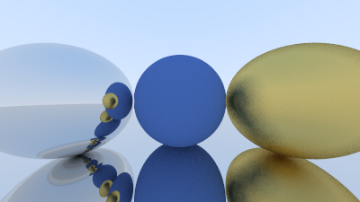

# Raytracer

Un moteur de ray tracing développé from scratch en C++, permettant de générer des images photoréalistes par simulation du comportement de la lumière.



## Description

Ce projet implémente un ray tracer complet en C++, capable de simuler l'interaction de la lumière avec différents objets et matériaux pour produire des images réalistes. Le ray tracing trace le chemin des rayons lumineux depuis la caméra à travers chaque pixel de l'image, calculant les intersections avec les objets de la scène et leurs propriétés optiques.

## Fonctionnalités

- Rendu d'objets primitifs (sphères, plans, etc.)
- Gestion de l'éclairage et des ombres
- Support de différents matériaux et textures
- Système de caméra configurable
- Configuration de scène via fichier `.conf`
- Compilation facilitée avec CMake

## Prérequis

- Compilateur C++ (compatible C++11 ou supérieur)
- CMake (version 3.0 ou supérieure)
- Make

## Installation

1. Clonez le dépôt :
```bash
git clone https://github.com/Kunamito/Raytracer.git
cd Raytracer
```

2. Compilez le projet :
```bash
./compile.sh
```

Ou manuellement avec CMake :
```bash
mkdir build
cd build
cmake ..
make
```

## Utilisation

Lancez le raytracer avec un fichier de configuration de scène :

```bash
./raytracer file.conf
```

Le fichier de configuration `file.conf` permet de définir :
- Les objets de la scène
- Les sources lumineuses
- Les paramètres de la caméra
- Les propriétés des matériaux

## Structure du projet

```
Raytracer/
├── include/          # Fichiers d'en-tête (.h, .hpp)
├── src/             # Fichiers source (.cpp)
├── CMakeLists.txt   # Configuration CMake
├── compile.sh       # Script de compilation
└── file.conf        # Exemple de fichier de configuration
```

## Technologies utilisées

- **Langage** : C++
- **Build system** : CMake
- **Shell scripting** : Bash

## Configuration de scène

Le fichier de configuration permet de définir votre scène de manière déclarative. Consultez `file.conf` pour un exemple de configuration.

## Contribution

Les contributions sont les bienvenues ! N'hésitez pas à :
- Ouvrir une issue pour signaler un bug
- Proposer de nouvelles fonctionnalités
- Soumettre une pull request

## Licence

Ce projet est développé dans un cadre éducatif.

## Auteur

**Kunamito**
- GitHub: [@Kunamito](https://github.com/Kunamito)

---

⭐ N'hésitez pas à star le projet si vous le trouvez intéressant !